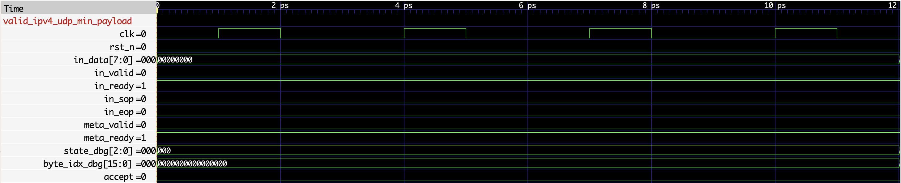

# RTL Ethernet Frame Parser

This project implements a streaming Ethernet / IPv4 / UDP frame parser in SystemVerilog, verifies it with a Verilator C++ scoreboard against a software reference parser, and uses Python tooling for constrained-random packet generation, randomized backpressure, trace parsing, and functional coverage reporting.

```text
Python packet generation
        |
        v
C++ Verilator testbench
        |
        v
Streaming SystemVerilog parser
        |
        v
C++ reference parser and scoreboard
        |
        v
Python trace and coverage reports
```

## What It Parses

- Ethernet II headers
- Optional single 802.1Q VLAN tag
- IPv4 headers with `IHL = 5`
- UDP headers

The base parser validates minimum Ethernet frame length, EtherType support, VLAN inner EtherType support, IPv4 version, IPv4 IHL, IPv4 total length consistency, IPv4 protocol, and UDP length consistency. IPv4 and UDP checksums are parsed as bytes in the packet stream but are not validated in the base version.

## RTL Interface

The parser accepts one byte per handshake:

```systemverilog
input  logic [7:0] in_data;
input  logic       in_valid;
output logic       in_ready;
input  logic       in_sop;
input  logic       in_eop;
```

Metadata is emitted with valid/ready backpressure:

```systemverilog
output logic       meta_valid;
input  logic       meta_ready;
output parser_meta_t meta;
```

For C++ verification, the top also exposes `meta_flat`, a deterministic packed view of every metadata field.

## Build And Run

Build the Verilator simulator:

```bash
make build
```

Run the directed corpus:

```bash
make run
```

Run directed tests plus 500 seeded random tests:

```bash
make regression
```

The random corpus starts with coverage-closure seed cases, then fills the rest with constrained random packets and negative tests across VLAN mode, EtherType, IPv4 validity, UDP validity, frame length, truncation, and backpressure.

Trace one named directed test:

```bash
make trace CASE=valid_ipv4_udp_min_payload
```

Generate a VCD waveform for one named directed test:

```bash
make waves CASE=valid_ipv4_udp_min_payload
```

Capture or refresh a PNG screenshot from GTKWave:

```bash
make wave-screenshot CASE=valid_ipv4_udp_min_payload
```

## Waveform Preview

The screenshot below shows the `valid_ipv4_udp_min_payload` directed case opened in GTKWave. It captures the byte-stream handshake (`in_valid`, `in_ready`, `in_sop`, `in_eop`), metadata handshake (`meta_valid`, `meta_ready`), and parser debug signals (`state_dbg`, `byte_idx_dbg`, `accept`) during the start of the frame parse.



Generate a coverage report from the latest regression artifacts:

```bash
make report
```

The report includes a functional coverage matrix:

```text
VLAN x EtherType x IPv4-validity x UDP-validity x frame-length bucket
```

`results/coverage.md` includes required-bin HIT/MISS status, per-dimension bin counts, observed matrix bins, backpressure bins, and trace-derived error counts.

## Example Output

```text
[PASS] valid_ipv4_udp_min_payload
[PASS] valid_ipv4_udp_payload_32
[PASS] valid_vlan_ipv4_udp
Regression: 18/18 PASS
Regression complete: directed 18/18 random 500/500
```

Example metadata trace line:

```text
cycle=49 event=meta ready=1 dst_mac=0xffffffffffff src_mac=0x001122334455 ethertype=0x0800 vlan=0 ipv4=1 udp=1 src_ip=0xc0a8010a dst_ip=0x08080808 udp_src=0x3039 udp_dst=0x0035 udp_len=0x0008 frame_len=42 header_bytes=42
```

## Repository Layout

```text
rtl/      SystemVerilog package and parser RTL
sim/      Verilator C++ testbench, reference parser, scoreboard, trace logger
tools/    Python packet generation, regression, trace, and coverage tools
screenshots/ Curated waveform screenshots
docs/     Architecture and verification notes
tests/    Python unit tests for tooling
```

Generated artifacts are written to `corpus/`, `logs/`, `waves/`, `results/`, and `obj_dir/` when you run the Makefile targets. They are intentionally ignored by git.

## Limitations

- Only one VLAN tag is supported.
- IPv4 options are flagged as unsupported.
- TCP, ICMP, ARP, and IPv6 are identified as unsupported rather than fully parsed.
- IPv4 and UDP checksums are not validated.
- The base RTL intentionally prioritizes clarity over line-rate microarchitecture.

## Future Work

- IPv4 header checksum validation
- IPv4 options support
- TCP metadata extraction
- QinQ / stacked VLAN support
- AXI-Stream wrapper
- Output FIFO and throughput analysis
